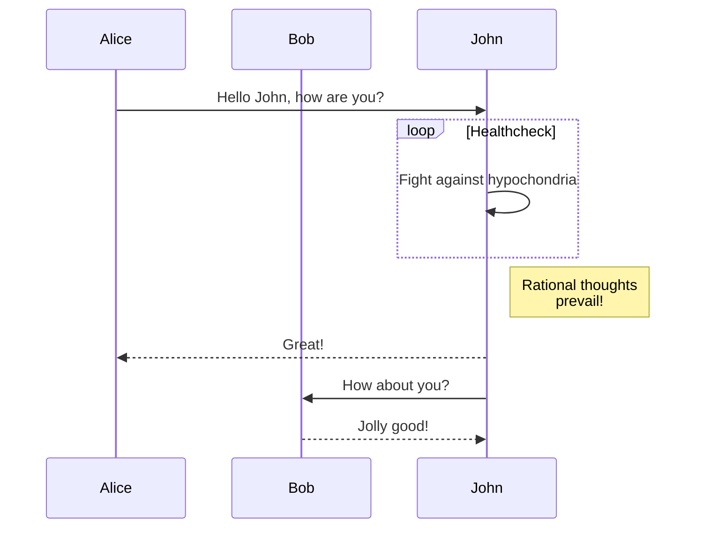
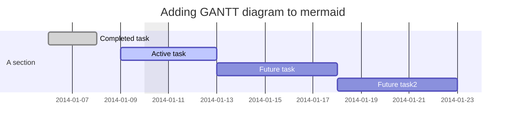

# mermaidで記述できるダイアグラムの記述例とコード 

## フローチャート
フローチャートとは

フローチャート (flowchart) は、業務のプロセスや業務フローのステップ、システム、順序、判断、コンピューターアルゴリズムなどを表した流れ図のことを言い、「フロー図」とも呼ばれます。 多種多様なフローチャートがありますが、基本は最も単純な形式のプロセスマップと言えるでしょう。


code
```
graph TD;
    A-->B;
    A-->C;
    B-->D;
    C-->D;
```


***
# シーケンス図


シーケンス図とは「プログラムの処理の流れや概要」を設計する際に使われます。オブジェクト指向のソフトウェア設計においては、グローバルスタンダードの設計手法と言っても過言ではありません。

プログラムの処理の流れや概要について、具体的には「クラスやオブジェクト間のやり取り」を「時間軸に沿って」、図で表現します。UMLの中では「相互作用図」の1つに位置付けられています。

なお、シーケンス図はシステム設計時のみならず設計書の無い既存システムの分析（リバースエンジニアリング）にも使われることがあります。


code
```
sequenceDiagram
    participant Alice
    participant Bob
    Alice->>John: Hello John, how are you?
    loop Healthcheck
        John->>John: Fight against hypochondria
    end
    Note right of John: Rational thoughts <br/>prevail!
    John-->>Alice: Great!
    John->>Bob: How about you?
    Bob-->>John: Jolly good!
```


***
# ガントダイアグラム
ガントチャート「英語：Gantt Chart」とは、プロジェクト、スケジュールやタスクの開始日から、完了日までの情報をツリー構造や帯状グラフ表したチャート（図）です。全てのタスク管理、工数管理やスケジュール管理の進捗状況や各メンバーのタスク情報の可視化が可能になり、効率的にプロジェクトを漏れなく進めていくことができます。 

ガントチャートの構造はスケジュール管理表に似ており、個別のタスクとその間のタスクの依存関係、タスクやスケジュールの担当者や作業期間、プロジェクト全体の情報を可視化するチャートです。ガントチャートは、一つ一つの作業を明確に図式化し、チーム全体が作業の期限を把握することができるポイントが一つのメリットとなります。


code
```
gantt
dateFormat  YYYY-MM-DD
title Adding GANTT diagram to mermaid
excludes weekdays 2014-01-10

section A section
Completed task            :done,    des1, 2014-01-06,2014-01-08
Active task               :active,  des2, 2014-01-09, 3d
Future task               :         des3, after des2, 5d
Future task2               :         des4, after des3, 5d
```




