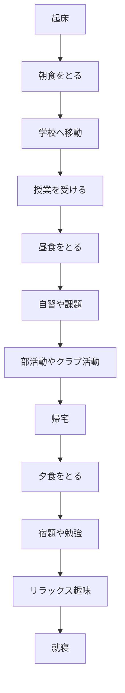

# mermaidで記述できるダイアグラムのチュートリアル

目次
```
1 作り方
2 説明
3 作成
4 まとめ
```

## 1 フローチャートの書き方
フローチャートの書き方は以下のコードになります。

code
```
graph TD;
    A-->B;
    A-->C;
    B-->D;
    C-->D;
```
フロチャートは上のコード通りになります。

***
## 2 フロチャートとは

フローチャート (flowchart) は、業務のプロセスや業務フローのステップ、システム、順序、判断、コンピューターアルゴリズムなどを表した流れ図のことを言い、「フロー図」とも呼ばれます。 多種多様なフローチャートがありますが、基本は最も単純な形式のプロセスマップと言えるでしょう。

***

## 3 実際に作って見る

先ほどのコードのように書いてmermaidを使って表示させてみると以下の通りになります。

学生の一日


***
## 4 まとめ
Mermaidを使用することで、簡潔な記法でフロチャート図を作成することができます。業務のプロセスや業務フローのステップ、システム、順序、判断、コンピューターアルゴリズムなどを理解しやすくすることができます。