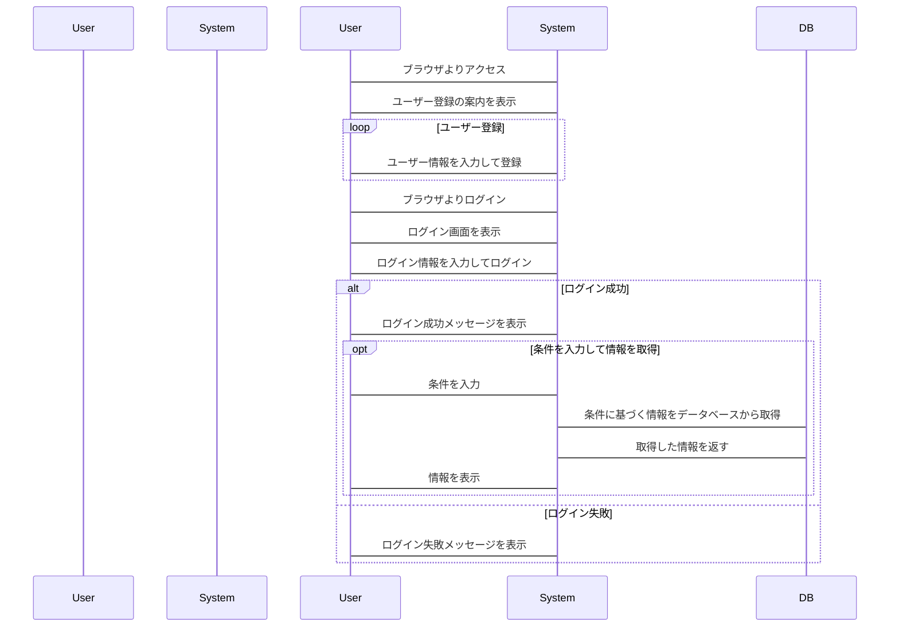
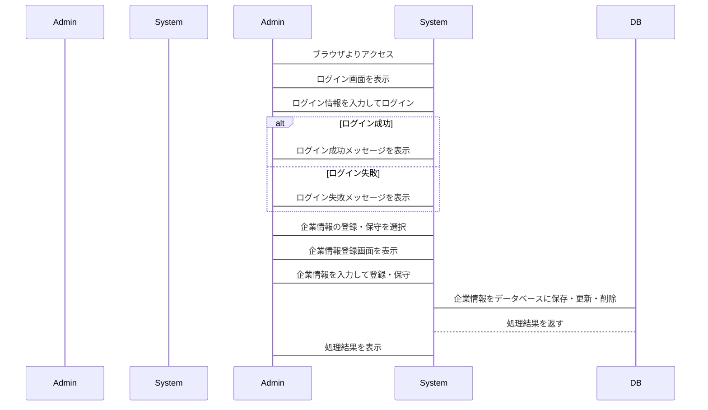

利用者の操作シーケンス

```mermaid
sequenceDiagram
participant 利用者 as User
participant システム as System
User->System: ブラウザよりアクセス
System->User: ユーザー登録の案内を表示

loop ユーザー登録
  User->System: ユーザー情報を入力して登録
end

User->System: ブラウザよりログイン
System->User: ログイン画面を表示

User->System: ログイン情報を入力してログイン

alt ログイン成功
  System->User: ログイン成功メッセージを表示

  opt 条件を入力して情報を取得
    User->System: 条件を入力
    System->DB: 条件に基づく情報をデータベースから取得
    DB->System: 取得した情報を返す
    System->User: 情報を表示
  end

else ログイン失敗
  System->User: ログイン失敗メッセージを表示
end
```
管理の操作

```mermaid
sequenceDiagram
participant 管理者 as Admin
participant システム as System

Admin->System: ブラウザよりアクセス
System->Admin: ログイン画面を表示

Admin->System: ログイン情報を入力してログイン

alt ログイン成功
  System->Admin: ログイン成功メッセージを表示
else ログイン失敗
  System->Admin: ログイン失敗メッセージを表示
end

Admin->System: 企業情報の登録・保守を選択
System->Admin: 企業情報登録画面を表示

Admin->System: 企業情報を入力して登録・保守
System->DB: 企業情報をデータベースに保存・更新・削除

DB-->System: 処理結果を返す
System->Admin: 処理結果を表示

```
